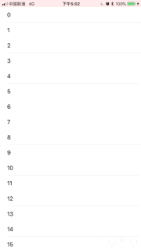
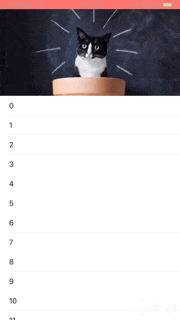

# 介绍
SpringTableHeader 是一个非常基础的 UIScrollView 的头部弹性视图，你可以用它实现以下功能:

1. 给 scrollview 头部弹性空间设置背景色；

``` objc
SpringTableHeaderView *header = [SpringTableHeaderView new];
header.contentView.backgroundColor = UIColor.greenColor;
header.intrinsicContentHeight = 0;

[scrollView setTableHeaderView:header];
```



2. 给 scrollview 添加头部背景图片放大功能；

``` objc
UIImageView *imgView = [[UIImageView alloc] initWithImage:img];
imgView.clipsToBounds = YES;
imgView.contentMode = UIViewContentModeScaleAspectFill;

SpringTableHeaderView *header = [SpringTableHeaderView new];
header.contentView = imgView;
header.intrinsicContentHeight = 200;

[scrollView setTableHeaderView:header];
```




